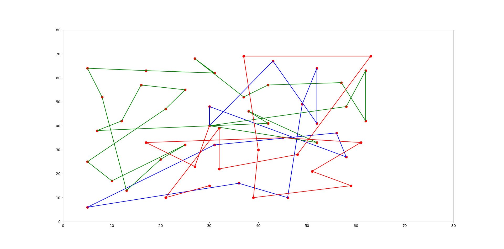
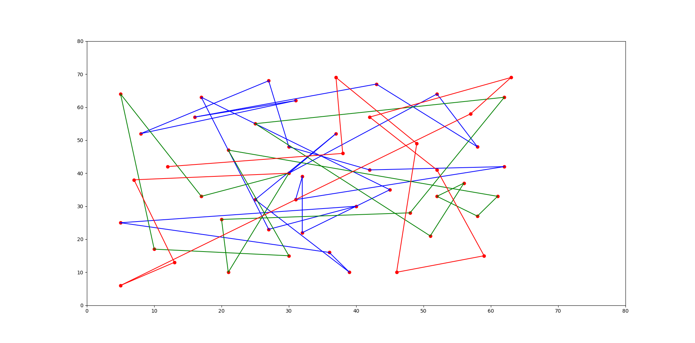

# Bee-Colony-for-Vehicle-Routing
**Artificial Bee Colony algorithm for Vehicle Routing Problem**

> Vehicle routing with two constraints: distance and customer demand (weight).

---

Run: python ABC.py

Input n: the number of customers

Input m: the number of vehicles

Input k: the number of output solutions

Input c: the capacity of each vehicle

  
---

**Standard benchmark** 

Problem 8 and problem 9 in [2]

---

**Results**

- 5000 iterations

- 10000 iterations

**References**

[[1] Szeto, Wai Yuen, Yongzhong Wu, and Sin C. Ho. "An artificial bee colony algorithm for the capacitated vehicle routing problem." European Journal of Operational Research 215.1 (2011): 126-135.](http://citeseerx.ist.psu.edu/viewdoc/download?doi=10.1.1.457.8027&rep=rep1&type=pdf) 

[[2] Christofides, Nicos, and Samuel Eilon. "An algorithm for the vehicle-dispatching problem." Journal of the Operational Research Society 20.3 (1969): 309-318.](https://link.springer.com/article/10.1057/jors.1969.75)
