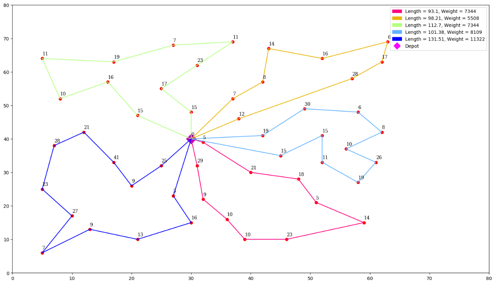
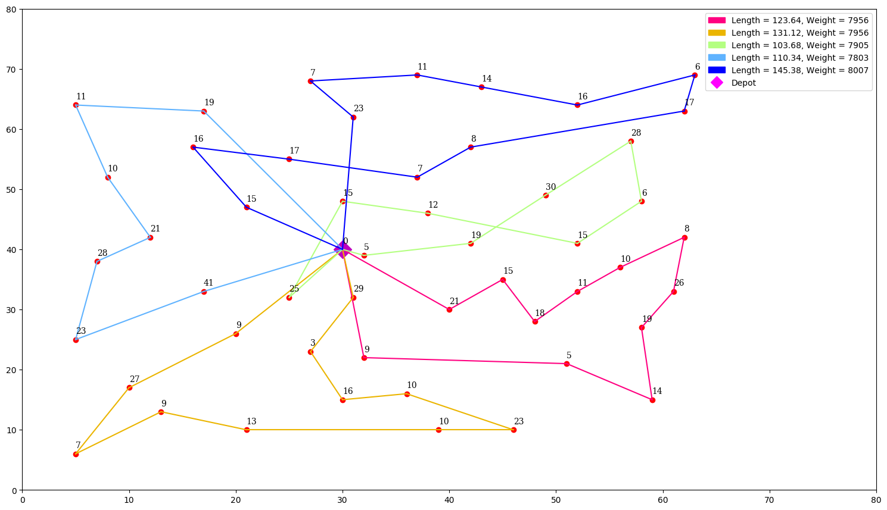
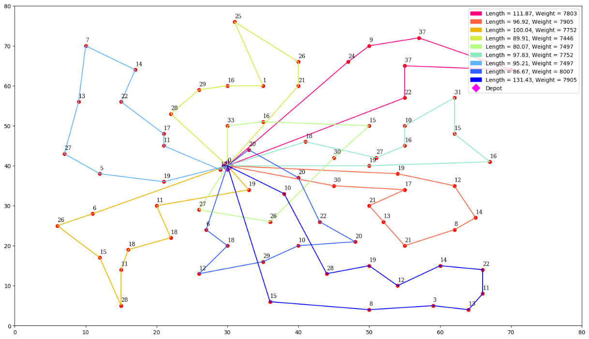

# Bee-Colony-for-Vehicle-Routing
**Artificial Bee Colony algorithm for Vehicle Routing Problem**

Variant: Capacitated Vehicle Routing Problem (CVRP)

---

## 1. Members

1612174 - Phùng Tiến Hào

1612269 - Võ Quốc Huy

---

> CVRP with two constraints: distance and customer demand (weight).

---

## 2. How to run

- Get help:
```
python ABC.py -h
```

- Run Bee
```
python ABC.py -f ./data/problem_8.txt -n 50 -m 5 -k 25 -c 8000 -iter 20000 -lim 50
```

- Run Bee with Genetic algorithm
```
python ABC.py -f ./data/problem_8.txt -n 50 -m 5 -k 25 -c 8000 -iter 20000 -lim 50 -ft_ga
```
where:
- f: input file
- n: the number of customers
- m: the number of vehicles
- k: the number of output solutions
- c: the capacity of each vehicle
- iter: the number of iterations
- lim: the permissaile limit iteration of each food source which quality has not been improved
- ft_ga: enable to combine bee and ga.

## 3. Standard benchmark 

Problem 8 and problem 9 in [2]


**Results**

- Parameter set 1



- Parameter set 2



- Parameter set 3




## References

[[1] Szeto, Wai Yuen, Yongzhong Wu, and Sin C. Ho. "An artificial bee colony algorithm for the capacitated vehicle routing problem." European Journal of Operational Research 215.1 (2011): 126-135.](http://citeseerx.ist.psu.edu/viewdoc/download?doi=10.1.1.457.8027&rep=rep1&type=pdf) 

[[2] Christofides, Nicos, and Samuel Eilon. "An algorithm for the vehicle-dispatching problem." Journal of the Operational Research Society 20.3 (1969): 309-318.](https://link.springer.com/article/10.1057/jors.1969.75)
